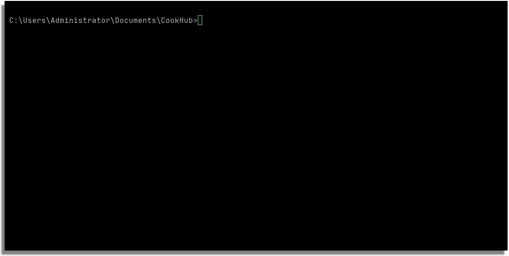

# CookHub

🍴 CookHub é um simples programa feito em python sem o uso de libs para ajudar Rafael a organizar suas receitas em um só lugar!

## Instalação

Use o git para instalar o [cookhub](https://git-scm.com/) de forma rapida

```bash
git clone https://github.com/kaik-e/CookHub
```

## Demo


